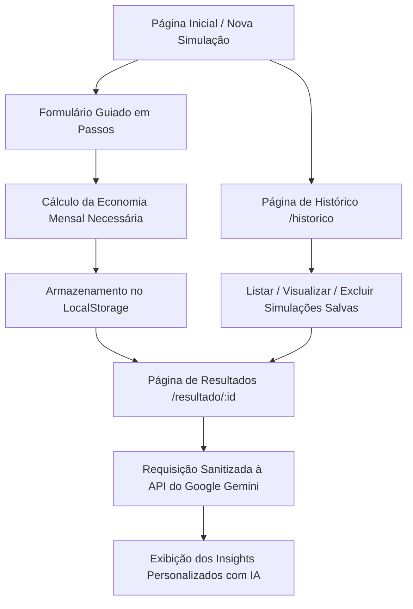

# 💰 PrumIA - Educador Financeiro Inteligente com IA


> **Transforme seus objetivos financeiros em planos realizáveis.**  
> O **PrumIA** é uma aplicação web moderna de educação financeira que combina simulação de metas (cálculos de aporte necessário, prazos e comprometimento de renda) com a inteligência artificial do **Google Gemini** para fornecer diagnósticos, conselhos práticos, sugestões de investimento e estratégias de renda extra adaptados ao perfil de cada usuário.

---

## 🌟 Principais Funcionalidades

- **Simulação Financeira Guiada (Formulário Multi-passos)**:
  - Definição do Nome e Valor da Meta (`R$`).
  - Definição do Prazo desejado em Meses.
  - Apuração de Renda Mensal Bruta, Custos Fixos de Vida e Valor de Dívidas/Parcelas.
  - Cálculo automático instantâneo da economia mensal necessária.

- **Diagnósticos e Insights Gerados por IA (Google Gemini)**:
  - **Status de Viabilidade**: Classificação automática entre *Meta Viável no Prazo*, *Ajuste Necessário* ou *Inviável no Prazo*.
  - **Diagnóstico Financeiro**: Análise do comprometimento da renda em relação aos gastos fixos e dívidas.
  - **Plano de Ação Personalizado**: Dicas práticas de redução de custos, alternativas de investimentos adequados e opções de renda extra.
  - **Mensagem Motivacional**: Apoio comportamental para manter o foco na meta.

- **Histórico Local de Simulações (`/historico`)**:
  - Armazenamento persistente das simulações via `localStorage`.
  - Exibição de cartões resumo com valor da meta, prazo e aporte mensal necessário.
  - Opções para reabrir o relatório completo de uma simulação antiga ou excluir registros do histórico.

- **Painel Avançado de Acessibilidade & Tema (WCAG 2.1)**:
  - **Modos de Daltonismo**: Modos de contraste adaptados para Protanopia, Deuteranopia e Tritanopia.
  - **Ajustes Tipográficos**: Controle de tamanho de fonte, altura de linha, espaçamento entre letras e suporte à fonte adaptada para Dislexia (`Lexend`).
  - **Navegação por Teclado**: Suporte a *Skip to Content* ("Pular para o conteúdo principal") via tecla `Tab`.
  - **Modo Escuro/Claro**: Alternância unificada de temas visuais em toda a aplicação.

---

## 🏗️ Fluxo da Aplicação



---

## 🚀 Tecnologias Utilizadas

| Tecnologia | Descrição |
|---|---|
| **React 19** | Biblioteca JavaScript para construção de interfaces reativas |
| **TypeScript** | Tipagem estática para maior segurança e qualidade do código |
| **Vite** | Ferramenta de build rápida com suporte a Hot Module Replacement (HMR) |
| **Tailwind CSS v4** | Framework utilitário de CSS com variáveis integradas |
| **Google Gemini API** | Modelo generativo de IA (`gemini-flash-latest`) para educação financeira |
| **React Router v7** | Gerenciamento de rotas e navegação na aplicação |
| **Lucide React** | Biblioteca de ícones acessíveis e vetorizados |

---

## 📁 Estrutura de Pastas

```text
PrumIA/
├── src/
│   ├── components/      # Componentes atômicos reutilizáveis (Button, Input, Header, PageHero)
│   ├── context/         # Provedores de contexto global (ThemeContext, AccessibilityContext)
│   ├── data/            # Configurações de formulário e construtor de prompts para a IA
│   ├── features/        # Módulos específicos de negócio (Simulation, SimulationResults, Insights)
│   ├── hooks/           # Custom hooks (useInsight, useSimulationStorage, useTheme, etc.)
│   ├── layout/          # Layout base com Header e Atalhos de Acessibilidade
│   ├── pages/           # Páginas da aplicação (SimulationFormPage, SimulationResultsPage, SimulationHistoryPage)
│   ├── routers/         # Configuração de rotas da aplicação
│   ├── services/        # Serviço de comunicação com a API do Google Gemini (aiService.ts)
│   ├── styles/          # Estilos CSS globais e variáveis de tema (theme.css)
│   ├── utils/           # Funções utilitárias (cálculo de juros e formatação de moeda)
│   ├── App.tsx          # Ponto de entrada com os Provedores da Aplicação
│   └── main.tsx         # Renderização do React DOM
├── public/              # Arquivos públicos e estáticos
└── package.json         # Dependências e scripts do projeto
```

---

## 🔧 Como Executar o Projeto Localmente

### Pré-requisitos

- **Node.js** `v18.0.0` ou superior.
- **npm** ou **yarn**.
- Uma chave de API do **Google AI Studio** ([Obter chave de API gratuita](https://aistudio.google.com/)).

### Passo a Passo

1. **Clonar o Repositório**:
   ```bash
   git clone https://github.com/ricardo-werner/DIO-Bootcamp-Santander_2026-Front_End-React_IA.git
   cd DIO-Bootcamp-Santander_2026-Front_End-React_IA/PrumIA
   ```

2. **Instalar Dependências**:
   ```bash
   npm install
   ```

3. **Configurar a Chave da API do Gemini**:
   Crie um arquivo `.env` na raiz do diretório `PrumIA` contendo:
   ```env
   VITE_GEMINI_API_KEY=SuaChaveDoGeminiAqui
   ```

4. **Iniciar o Servidor de Desenvolvimento**:
   ```bash
   npm run dev
   ```
   Acesse a aplicação no seu navegador: `http://localhost:5173`

5. **Executar a Compilação para Produção (Opcional)**:
   ```bash
   npm run build
   ```

---

## ♿ Compromisso com Acessibilidade (WCAG 2.1)

O **PrumIA** foi projetado seguindo as diretrizes universais de acessibilidade web:
- **Navegação por Teclado**: Todo o fluxo do formulário e menu pode ser utilizado sem mouse.
- **Leitores de Tela**: Suporte completo com atributos `aria-label`, `role="button"` e foco direcionado.
- **Atalho Skip Link**: Pule a barra de navegação direto para o conteúdo via tecla `Tab`.
- **Customização Visual**: Ajustes dinâmicos de contraste, fontes e auxílio a daltonismo integrados no painel flutuante.

---

## 📜 Licença e Créditos

Este projeto foi desenvolvido como parte do **Bootcamp Santander 2026 - Front-End & IA com React** na plataforma [DIO (Digital Innovation One)](https://www.dio.me/).
